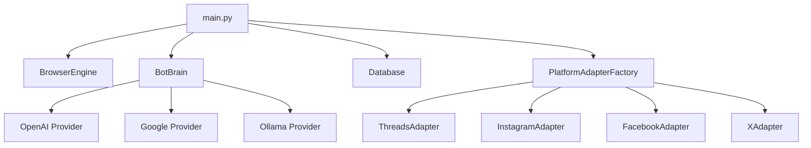

<!-- Language: [English](#social-bot) | [繁體中文](#social-bot-繁體中文) -->

<div align="center">


</div>

> ⚠️ **UNDER ACTIVE DEVELOPMENT** - This project is currently in early development. Features may be incomplete, unstable, or subject to significant changes. **Use at your own risk.**

# Social Bot

**Social Bot** is an automated social media interaction agent designed to fully automate the reply workflows of community managers. Leveraging Playwright, this project integrates with diverse Large Language Model (LLM) providers (OpenAI, Google Gemini, Ollama) to comprehend content—including visual analysis of post images—and automatically generate responses.

## Architecture



## Project Structure

```
Social Bot/
├── main.py                 # Entry point & main loop
├── config.py               # Configuration (Pydantic Settings)
├── requirements.txt        # Python dependencies
├── run.bat                 # Windows startup script
├── start.sh                # macOS/Linux startup script
├── .env                    # Environment variables (create this)
│
├── core/                   # Core modules
│   ├── brain.py            # LLM integration (OpenAI/Google/Ollama)
│   ├── browser.py          # Playwright browser engine
│   ├── db.py               # SQLite database for tracking replies
│   └── factory.py          # Platform adapter factory
│
├── adapters/               # Platform-specific adapters
│   ├── base.py             # Abstract base adapter
│   ├── threads_web.py      # Threads implementation
│   ├── instagram_web.py    # Instagram implementation
│   ├── facebook_web.py     # Facebook implementation
│   ├── x_web.py            # X/Twitter implementation
│   ├── line_web.py         # Line (placeholder)
│   ├── whatsapp_web.py     # WhatsApp (placeholder)
│   └── selectors.py        # CSS selectors for all platforms
│
└── data/                   # Runtime data
    ├── browser_context/    # Persistent browser session
    ├── bot.log             # Application logs
    └── replied.db          # SQLite database
```


## Development TODO

> **Development Roadmap** - Tracked features and planned work

### Phase 1: Enhance Existing Platforms ✅ Complete

- [x] **Threads**: Official account auto-reply (notification monitoring)
- [x] **Instagram**: Official account auto-reply (comment monitoring)
- [x] **Facebook**: Official account auto-reply (page comment monitoring)
- [x] Add `get_notifications()` method to BaseAdapter
- [x] Add `reply_to_comment()` method to BaseAdapter
- [x] Add operation mode selection in main.py (Feed Mode / Notification Mode)

### Phase 2: New Platform - Line

- [ ] Line Web login (QR Code)
- [ ] Line Voom feed scraping
- [ ] Line reply functionality
- [ ] Line CSS selectors

### Phase 3: New Platform - WhatsApp (Last Priority)

- [ ] WhatsApp Business API integration (official accounts only)
- [ ] Webhook setup for incoming messages
- [ ] Auto-reply via Business API
- [ ] ⚠️ **NOT for personal accounts** - Business accounts only

## Table of Contents

- [Key Features](#-key-features)
- [Architecture](#-architecture)
- [Quick Start](#-quick-start)
- [Configuration](#%EF%B8%8F-configuration)
- [Usage](#-usage)
- [Project Structure](#-project-structure)
- [Disclaimer](#-disclaimer--legal-notice)

## Key Features

### Multi-Platform Support

| Platform | Status | Description |
|----------|--------|-------------|
| Threads | Default | Primary supported platform |
| Instagram | Beta | Image gallery support available |
| Facebook | Alpha | Basic feed interaction |
| X / Twitter | Alpha | Basic functionality |
| Line | Planned | Under development |
| WhatsApp | Planned | Under development |

### Multi-LLM Support

- **OpenAI**: GPT-5-mini, GPT-5.2, GPT-4.1
- **Google**: Gemini 1.5 Pro, Gemini 1.5 Flash
- **Ollama**: Support for local open-source models (e.g., Qwen, Llama, LLaVA)

### Core Capabilities

- **Multimodal Visual Understanding**: Automatically detects images in posts and sends them to the AI for analysis to generate context-aware replies.
- **Human-Like Browsing**: Simulates real user browser interactions using Playwright Stealth to minimize detection risks.
- **Safety Mechanisms**:
  - Built-in API quota monitoring
  - Rate limiting (configurable delays)
  - Dry-Run mode (simulation only, no actual posting)
  - Consecutive error handling with automatic stop
- **Cross-Platform**: Optimized for Windows, macOS, and Linux environments.

## Quick Start

### Prerequisites

- **Python 3.10+**
- **Chrome / Edge Browser**
- API Key for at least one LLM provider (or local Ollama installation)

### Installation

#### Option 1: Using Quick Start Scripts (Recommended)

It provides automated scripts to handle environment setup, dependency installation, and launching the application in one go.

**For Windows:**
Simply double-click `run.bat`.

**For macOS / Linux:**
Run the `start.sh` script from your terminal.

1. **Grant execution permission** (first time only):

    ```bash
    chmod +x start.sh
    ```

2. **Run the script**:

    ```bash
    ./start.sh
    ```

The script will automatically:

- Create a virtual environment
- Install all dependencies (requirements.txt)
- Install Playwright browsers
- Launch the Social Bot

#### Option 2: Using start.sh (macOS/Linux)

1. Make the script executable:

    ```bash
    chmod +x start.sh
    ```

2. Run the script:

    ```bash
    ./start.sh
    ```

    It will handle virtual environment creation, dependencies, and startup.

#### Option 3: Manual Setup

1. **Create Virtual Environment**:

    ```bash
    python -m venv venv
    
    # Windows
    .\venv\Scripts\activate
    
    # Linux/Mac
    source venv/bin/activate
    ```

2. **Install Dependencies**:

    ```bash
    pip install -r requirements.txt
    playwright install
    ```

3. **Run the Application**:

    ```bash
    python main.py
    ```

## Configuration

Create a `.env` file in the project root with your API keys:

```env
# OpenAI Configuration
OPENAI_API_KEY=sk-...

# Google Gemini Configuration
GOOGLE_API_KEY=AIza...

# Ollama Configuration (Optional - for local models)
OLLAMA_BASE_URL=http://localhost:11434/v1
OLLAMA_MODEL=qwen2.5-vl

# Safety Settings
DRY_RUN=true                    # Set to false to enable actual posting
MAX_COMMENTS_PER_SESSION=10
MIN_DELAY_SECONDS=5
MAX_DELAY_SECONDS=15

# Browser Settings
HEADLESS=false                  # Set to true for headless mode
```

## Usage

1. Run the main script:

    ```bash
    python main.py
    ```

2. Follow the interactive prompts:
    - **Select Platform**: Choose from Threads, Instagram, Facebook, X/Twitter
    - **Select LLM Provider**: OpenAI, Google Gemini, or Ollama (local)
    - **Select Specific Model**: Choose from available models

3. The bot will:
    - Open a browser window
    - Navigate to the selected platform's login page
    - Wait for you to log in manually (first time only - session is persisted)
    - Start monitoring the feed and generating replies

### Dry-Run Mode

By default, `DRY_RUN=true` is enabled. In this mode:

- The bot will analyze posts and generate comments
- **No actual comments will be posted**
- Useful for testing and verifying behavior before going live

## ⚠️ Disclaimer / Legal Notice ⚠️

> **IMPORTANT: READ CAREFULLY BEFORE USE**

### Development Status

This project is currently **UNDER ACTIVE DEVELOPMENT**. The software is provided in an experimental state and:

- ❌ May contain bugs, errors, or incomplete features
- ❌ May experience breaking changes without prior notice
- ❌ Is NOT recommended for production use
- ❌ Has NOT been thoroughly tested in all scenarios

### Terms of Service Violations

**Using automation tools on social media platforms typically violates their Terms of Service.** By using this software, you acknowledge and accept:

1. **Account Suspension Risk**: Your social media accounts may be **permanently suspended or banned** for using automation tools.

2. **ToS Violations**: This software may violate the Terms of Service of:
   - Meta Platforms (Threads, Instagram, Facebook, WhatsApp)
   - X Corp (Twitter/X)
   - LINE Corporation
   - And potentially other platforms

3. **Legal Liability**: You are solely responsible for:
   - Compliance with all applicable local, national, and international laws
   - Any legal consequences arising from the use of this software
   - Understanding and adhering to the Terms of Service of each platform

### No Warranty

THE SOFTWARE IS PROVIDED "AS IS", WITHOUT WARRANTY OF ANY KIND, EXPRESS OR IMPLIED, INCLUDING BUT NOT LIMITED TO THE WARRANTIES OF MERCHANTABILITY, FITNESS FOR A PARTICULAR PURPOSE AND NONINFRINGEMENT. IN NO EVENT SHALL THE AUTHORS OR COPYRIGHT HOLDERS BE LIABLE FOR ANY CLAIM, DAMAGES OR OTHER LIABILITY, WHETHER IN AN ACTION OF CONTRACT, TORT OR OTHERWISE, ARISING FROM, OUT OF OR IN CONNECTION WITH THE SOFTWARE OR THE USE OR OTHER DEALINGS IN THE SOFTWARE.

### User Responsibilities

By using this software, you agree that:

1. ✅ You are using it **solely for educational and research purposes**
2. ✅ You understand the **risks of account suspension**
3. ✅ You will **not use this for spam, harassment, or malicious activities**
4. ✅ You take **full responsibility** for all actions performed by this software
5. ✅ The developers are **not liable** for any consequences

### Ethical Use Guidelines

If you choose to use this software, please:

- 🤝 Respect other users and communities
- 🚫 Do not use for spam or unsolicited advertising
- 🚫 Do not use to spread misinformation
- 🚫 Do not use for harassment or abuse
- ⏱️ Use reasonable rate limits to avoid disrupting platforms

**By using this software, you acknowledge that you have read, understood, and agree to all terms outlined in this disclaimer.**

---

# Social Bot (繁體中文)

> ⚠️ **開發中** - 本專案目前處於早期開發階段。功能可能不完整、不穩定，或隨時可能有重大變更。**請自行承擔使用風險。**

**Social Bot** 是一個自動化的社群媒體互動代理程式，旨在將社群小編的回文作業全數自動化進行。本專案利用 Playwright 並整合多種來源的大型語言模型服務供應商（OpenAI、Google Gemini、Ollama）來理解內容（包括貼文圖片的視覺分析）並自動生成回覆。

---

## 開發待辦清單

> **開發路線圖** - 追蹤功能與計劃中的工作項目

### 階段一：強化現有平台 ✅ 完成

- [x] **Threads**：官方帳號自動回覆（通知監控）
- [x] **Instagram**：官方帳號自動回覆（留言監控）
- [x] **Facebook**：官方帳號自動回覆（粉專留言監控）
- [x] 新增 `get_notifications()` 方法至 BaseAdapter
- [x] 新增 `reply_to_comment()` 方法至 BaseAdapter
- [x] 在 main.py 新增操作模式選擇（Feed Mode / Notification Mode）

### 階段二：新平台 - Line

- [ ] Line Web 登入（QR Code 掃碼）
- [ ] Line Voom 動態抓取
- [ ] Line 回覆功能
- [ ] Line CSS Selectors

### 階段三：新平台 - WhatsApp（最後優先）

- [ ] WhatsApp Business API 整合（僅限官方帳號）
- [ ] 設定訊息接收 Webhook
- [ ] 透過 Business API 自動回覆
- [ ] ⚠️ **不適用於私人帳號** - 僅限商業帳號

---

## 目錄

- [主要功能](#-主要功能)
- [快速開始](#-快速開始)
- [設定](#%EF%B8%8F-設定)
- [使用方式](#-使用方式)
- [免責聲明](#-免責聲明--法律聲明)

## 主要功能

### 多平台支援

| 平台 | 狀態 | 說明 |
|------|------|------|
| Threads | 預設 | 主要支援平台 |
| Instagram | Beta | 支援圖片輪播下載 |
| Facebook | Alpha | 基本動態互動 |
| X / Twitter | Alpha | 基本功能 |
| Line | 計劃中 | 開發中 |
| WhatsApp | 計劃中 | 開發中 |

### 多 LLM 支援

- **OpenAI**: GPT-5-mini、GPT-5.2、GPT-4.1
- **Google**: Gemini 1.5 Pro、Gemini 1.5 Flash
- **Ollama**: 支援本地開源模型（例如：Qwen、Llama、LLaVA）

### 核心能力

- **多模態視覺理解**：自動偵測貼文中的圖片並發送給 AI 分析，生成情境感知回覆。
- **仿人類瀏覽**：使用 Playwright Stealth 模擬真實使用者瀏覽器互動，降低偵測風險。
- **安全機制**：
  - 內建 API 配額監控
  - 速率限制（可設定延遲）
  - 模擬執行模式（僅模擬，不實際發文）
  - 連續錯誤處理與自動停止
- **跨平台支援**：針對 Windows、macOS 與 Linux 環境進行優化。

## 快速開始

### 系統需求

- **Python 3.10+**
- **Chrome / Edge 瀏覽器**
- 至少一個 LLM 供應商的 API 金鑰（或本地 Ollama 安裝）

### 安裝方式

#### 方式一：使用快速啟動腳本（推薦）

本專案提供了自動化腳本，可一次完成環境建置、套件安裝與程式啟動。

**Windows 使用者：**
直接雙擊 `run.bat` 即可。

**macOS / Linux 使用者：**
請在終端機執行 `start.sh` 腳本。

1. **給予執行權限**（僅首次需要）：

    ```bash
    chmod +x start.sh
    ```

2. **執行腳本**：

    ```bash
    ./start.sh
    ```

該腳本將自動執行以下動作：

- 建立虛擬環境
- 安裝所有依賴套件 (requirements.txt)
- 安裝 Playwright 瀏覽器核心
- 啟動 Social Bot 應用程式

#### 方式二：使用 start.sh（macOS/Linux）

1. 賦予執行權限：

    ```bash
    chmod +x start.sh
    ```

2. 執行腳本：

    ```bash
    ./start.sh
    ```

    它會自動處理虛擬環境、依賴安裝與啟動。

#### 方式三：手動設定

1. **建立虛擬環境**：

    ```bash
    python -m venv venv
    
    # Windows
    .\venv\Scripts\activate
    
    # Linux/Mac
    source venv/bin/activate
    ```

2. **安裝依賴套件**：

    ```bash
    pip install -r requirements.txt
    playwright install
    ```

3. **執行應用程式**：

    ```bash
    python main.py
    ```

## 設定

在專案根目錄建立 `.env` 檔案並填入您的 API 金鑰：

```env
# OpenAI 設定
OPENAI_API_KEY=sk-...

# Google Gemini 設定
GOOGLE_API_KEY=AIza...

# Ollama 設定（選用 - 用於本地模型）
OLLAMA_BASE_URL=http://localhost:11434/v1
OLLAMA_MODEL=qwen2.5-vl

# 安全設定
DRY_RUN=true                    # 設為 false 啟用實際發文
MAX_COMMENTS_PER_SESSION=10
MIN_DELAY_SECONDS=5
MAX_DELAY_SECONDS=15

# 瀏覽器設定
HEADLESS=false                  # 設為 true 啟用無頭模式
```

## 使用方式

1. 執行主程式：

    ```bash
    python main.py
    ```

2. 依照互動式提示操作：
    - **選擇平台**：從 Threads、Instagram、Facebook、X/Twitter 中選擇
    - **選擇 LLM 供應商**：OpenAI、Google Gemini 或 Ollama（本地）
    - **選擇特定模型**：從可用模型中選擇

3. 機器人將會：
    - 開啟瀏覽器視窗
    - 導航至所選平台的登入頁面
    - 等待您手動登入（僅首次需要 - 工作階段會保存）
    - 開始監控動態並生成回覆

### 模擬執行模式

預設啟用 `DRY_RUN=true`。在此模式下：

- 機器人會分析貼文並生成評論
- **不會實際發佈任何評論**
- 適合在正式使用前測試和驗證行為

---

## ⚠️ 免責聲明 / 法律聲明 ⚠️

> **重要：使用前請仔細閱讀**

### 開發狀態

本專案目前 **正在積極開發中**。軟體以實驗性狀態提供，且：

- ❌ 可能包含錯誤、漏洞或不完整的功能
- ❌ 可能在沒有事先通知的情況下發生重大變更
- ❌ **不建議** 用於正式環境
- ❌ **尚未** 在所有情況下進行完整測試

### 服務條款違規

**在社群媒體平台上使用自動化工具通常會違反其服務條款。** 使用本軟體即表示您承認並接受：

1. **帳號停權風險**：您的社群媒體帳號可能因使用自動化工具而被 **永久停權或封禁**。

2. **違反服務條款**：本軟體可能違反以下平台的服務條款：
   - Meta 平台（Threads、Instagram、Facebook、WhatsApp）
   - X Corp（Twitter/X）
   - LINE Corporation
   - 以及其他可能的平台

3. **法律責任**：您須自行負責：
   - 遵守所有適用的地方、國家和國際法律
   - 因使用本軟體而產生的任何法律後果
   - 理解並遵守各平台的服務條款

### 無擔保聲明

本軟體按「現狀」提供，不附帶任何明示或暗示的擔保，包括但不限於適銷性、特定用途適用性和非侵權性的擔保。在任何情況下，作者或版權持有人均不對任何索賠、損害或其他責任負責，無論是因合約、侵權或其他原因，由軟體或軟體的使用或其他交易引起或與之相關。

### 使用者責任

使用本軟體即表示您同意：

1. ✅ 您 **僅將其用於教育和研究目的**
2. ✅ 您理解 **帳號停權的風險**
3. ✅ 您 **不會將其用於垃圾郵件、騷擾或惡意活動**
4. ✅ 您對本軟體執行的所有操作 **承擔全部責任**
5. ✅ 開發者對任何後果 **不承擔責任**

### 道德使用準則

如果您選擇使用本軟體，請：

- 尊重其他使用者和社群
- 不要用於垃圾訊息或未經請求的廣告
- 不要用於散播不實資訊
- 不要用於騷擾或濫用
- 使用合理的速率限制以避免干擾平台

---

**使用本軟體即表示您已閱讀、理解並同意本免責聲明中列出的所有條款。**

---

## License

MIT License - See [LICENSE](LICENSE) for details.
